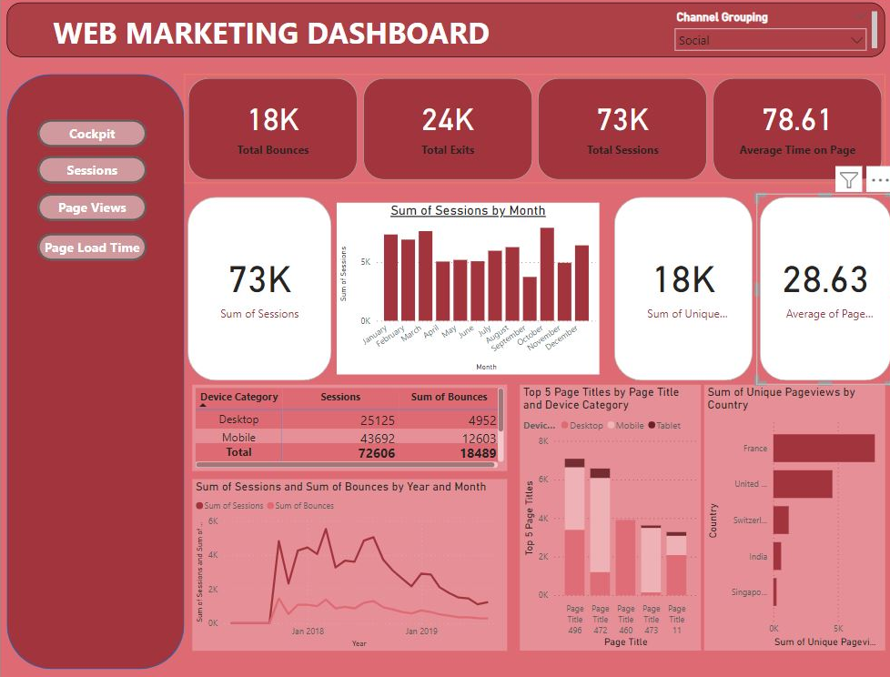

# Web Marketing Dashboard (Power BI)

A Power BI dashboard for website traffic analysis: sessions, bounces, exits, page views and time on page, broken down by channel, device and country.

## What it shows

- Headline KPIs: total sessions, bounces, exits and average time on page
- Sessions by month, and sessions against bounces over time
- Sessions and bounces by device category (desktop, mobile, tablet)
- Top pages by device category
- Unique page views by country
- A channel grouping slicer and navigation buttons for the Cockpit, Sessions, Page Views and Page Load Time views

## Report design

- KPI cards for the headline numbers, with supporting charts and a device table below
- Column, line, stacked column and bar charts chosen to match each comparison
- Navigation buttons to move between the report views
- Channel grouping slicer that filters every visual together

## Files

| File | Description |
|---|---|
| `web marketing dashboard.pbix` | Power BI report (open with Power BI Desktop) |
| `dashboard-preview.png` | Preview of the dashboard |
| `web marketing dashboard.JPG` | Original screen capture |

## Tools

Power BI Desktop

## Author

**Omer Naeem Khan** — Data Analyst
[GitHub](https://github.com/OmerNaeemKhan) · [LinkedIn](https://www.linkedin.com/in/omer-khan-03833749)
